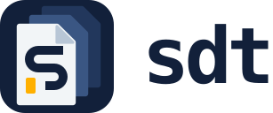

# sdt

[](https://github.com/sandrolain/sdt/actions/workflows/ci.yml)
[](https://github.com/sandrolain/sdt/actions/workflows/security.yml)
[](https://goreportcard.com/report/github.com/sandrolain/sdt)
[](LICENSE)

**Smart Developer Tools** — a local-first toolkit for developers and AI agents.



## What is sdt

`sdt` combines a composable command-line toolset with a file-based project
context for developers and AI agents. It provides deterministic commands for
encoding, hashing and cryptography, JWT handling, data conversion and
templating, text and prompt utilities, and network diagnostics. Alongside these
operations, it keeps project knowledge, decisions and work in versioned
Markdown files that people and agents can inspect, review and reuse.

## Orientation

SDT is **local-first, agent-aware and evidence-driven**:

- **Local-first** — knowledge stays in the repository as readable, versioned
 files; the core workflow works offline without a database or daemon.
- **Agent-aware** — commands, schemas, generated instructions and document
 templates are designed for both human and machine consumers.
- **Evidence-driven** — analyses, plans, decisions, tasks and reports retain
 their sources and are checked with deterministic linting and tests.
- **Composable** — small commands work in pipelines, while specialized context
 documents compose into a durable project memory.
- **Portable** — the Go implementation is pure-Go, requires no CGO toolchain,
 and targets Linux, macOS and Windows.

## Vision

SDT aims to be a lightweight **operating layer for agent-assisted development**:
a common surface for running repeatable operations, preserving project
reasoning, turning sources into reusable knowledge, and verifying that completed
work is supported by concrete artifacts and checks.

It does not replace git, the editor or the agent. It connects them with small
commands for execution, structured documents for project memory, and an
explicit workflow for governing change. Human review remains part of the
process wherever a change needs a decision or approval.

## Why it is useful

SDT is useful when a project needs to:

- give agents durable context and conventions instead of relying on implicit
 memory;
- turn an objective into an analysis, plan, task list and verifiable report;
- keep decisions, sources, RFCs and architecture knowledge close to the code;
- run conversions, security operations and diagnostics in reproducible
 pipelines;
- search and validate the project context without depending on a remote service.

## Features

- **Machine-readable output** — `--format json|yaml|text` on every command; ANSI suppressed automatically when stdout is not a TTY
- **Pipe-friendly** — reads stdin, writes stdout, errors to stderr; composable with shell pipes
- **File-based knowledge** — durable project knowledge as versioned Markdown under `context/` (architecture, decisions/ADRs, analyses, plans, RFCs, prompts, tasks and reports) with a generated index, fully offline, no database
- **AI-agent tooling** — manifest discovery, command schemas, generated per-command docs, project work files and task lists
- **Context management** — structured knowledge base with typed documents, a generated index (`sdt context reindex`), linting (`sdt context lint`), and agent instruction files in `context/instructions/`
- **Agent instructions** — per-project conventions, CLI reference, and workflow guides generated and maintained under `context/instructions/`
- **Role profiles** — closed role register with generated three-layer profiles under `context/roles/` (`sdt agent roles show|init|check`): project-layer facts derived from repo evidence, user preferences preserved across `--force`, deterministic check for profile set, drift and owned-path overlap
- **Zero CGO** — pure-Go build, no C toolchain required
- **Cross-platform** — Linux, macOS, Windows

## Installation

```bash
go install github.com/sandrolain/sdt@latest
```

Build from source:

```bash
git clone https://github.com/sandrolain/sdt
cd sdt
go build -o bin/sdt ./cli
```

## Documentation

- `docs/` — per-command reference (regenerate with `sdt docs`)
- `context/instructions/cli.md` — curated CLI usage and examples for agents
- `context/instructions/reference.md` — SDT command reference overview
- `context/wiki/` — curated project knowledge distilled from source material
- `AGENTS.md` — conventions for agents working on this repository
- [CONTRIBUTING.md](./CONTRIBUTING.md) — contribution guidelines

## Development

```bash
# Run tests (≥80% coverage required)
go test ./...

# Lint
golangci-lint run ./...

# Vulnerability check
govulncheck ./...
```

## Context & Knowledge

Project knowledge lives under `context/` as versioned Markdown files:

- `architecture/` — living architecture docs (essential tier)
- `decisions/` — Architecture Decision Records (ADRs), append-only
- `plan/` — development plans
- `tasks/` — per-phase task files
- `worklog/` — final reports, append-only
- `notes/` — free-form annotations
- `questions/` — open questions with provenance
- `instructions/` — agent instruction files and templates
- `roles/` — generated role profiles (shared rules + one profile per role; `sdt agent roles init` / validated by `sdt agent roles check`)
- `wiki/` — curated knowledge pages with links and relations
- `refs/` — archived source material used during knowledge distillation
- `index.md` — generated knowledge index (entry point)

Use `sdt context reindex` to regenerate the index and `sdt context lint` to
validate document structure. Full reference: `sdt context --help`.

## License

[MIT License](LICENSE) — Copyright (c) 2025 Sandro Lain
