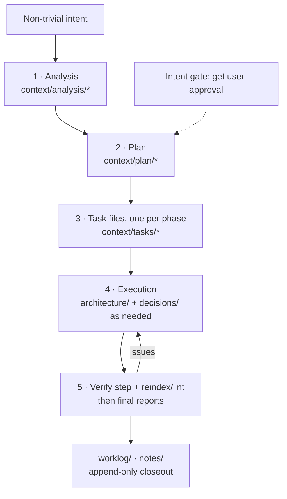
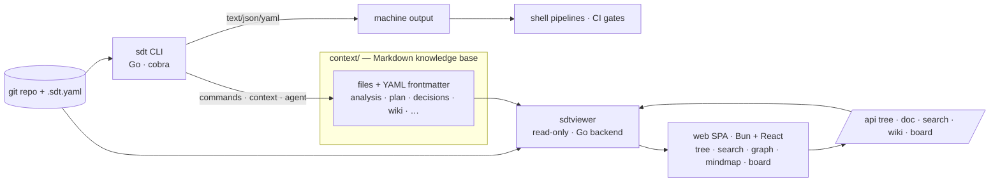
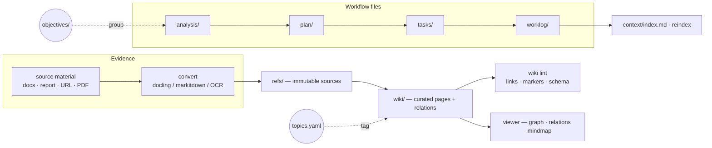

# sdt

[](https://github.com/sandrolain/sdt/actions/workflows/ci.yml)
[](https://github.com/sandrolain/sdt/actions/workflows/security.yml)
[](https://goreportcard.com/report/github.com/sandrolain/sdt)
[](LICENSE)

**Smart Developer Tools** — a local-first toolkit that turns a project into a
navigable, evidence-driven knowledge base for developers and AI agents.


## What is sdt

`sdt` is two things working as one system:

1. a **composable command-line toolset** — deterministic commands for
   encoding, hashing and cryptography, JWT handling, data conversion and
   templating, text and prompt utilities, and network diagnostics;
2. a **file-based project context** — versioned Markdown knowledge
   (`context/`) where analyses, plans, decisions, tasks, proposals and wiki
   pages keep the reasoning of a project next to its code, checked by
   deterministic linting and served by a local browser viewer.

Because the knowledge is plain files with YAML frontmatter, both people and
agents can read, review and reuse it — and `git` already versions it.

## Orientation

SDT is **local-first, agent-aware and evidence-driven**:

- **Local-first** — knowledge stays in the repository as readable, versioned
  files; the workflow works offline, with no database, daemon or remote
  service.
- **Agent-aware** — commands, schemas, generated instructions, document
  templates and role profiles are designed for both human and machine
  consumers, with explicit contracts and deterministic output.
- **Evidence-driven** — documents retain their sources and provenance; work is
  checked with deterministic linting, reviews and gates before it is
  considered done.
- **Composable** — small commands work in pipelines, while specialized
  context documents compose into a durable project memory.
- **Portable** — the Go implementation is pure-Go, requires no CGO toolchain,
  and targets Linux, macOS and Windows.

## Philosophy

Three principles shape how SDT works.

### Files are the source of truth

Project knowledge lives as ordinary Markdown files with YAML frontmatter. No
database, no proprietary store, no daemon that must be running. This keeps
every artifact **diffable, reviewable and greppable** with the tooling a team
already trusts; `git blame` and `git diff` discipline memory the same way they
discipline code. `context/` documents are generated, lint-checked and indexed,
but the file itself is always the canonical form.

### Evidence over authority

A decision or a completed claim is only as good as the trail behind it. SDT
encodes that in the workflow: analyses feed plans, plans produce one task file
per phase, tasks close only through the verify-step, and reports land in the
append-only worklog. Frontmatter carries `links`, `sources`, provenance
(`agent`/`role`) and `objective`/`topic` groupings, so any conclusion can be
walked back to its evidence. Linting, `agent verify`, `agent doctor` and the
delivery gate (`agent gate`) are mechanical checks that refuse to certify
unverified work.

### Humans stay in control

SDT guides the chain **analysis → plan → task files → execution → reports**,
but it never auto-approves itself. Non-trivial work starts as an analysis, the
plan is approved by the user, phases execute one task file at a time, and
decisions that change the project remain human decisions. Agents are given
deterministic, inspectable tools — not an opaque automation layer.



## Vision

SDT aims to be a lightweight **operating layer for agent-assisted development**:
a common surface for running repeatable operations, preserving project
reasoning, turning sources into reusable knowledge, and verifying that
completed work is supported by concrete artifacts and checks.

It does not replace git, the editor or the agent. It connects them with small
commands for execution, structured documents for project memory, and an
explicit workflow for governing change. Human review remains part of the
process wherever a change needs a decision or approval.

## Why it is useful

SDT is useful when a project needs to:

- give agents durable context and conventions instead of relying on implicit
  memory;
- turn an objective into an analysis, plan, task list and verifiable report;
- keep decisions, sources, proposals and architecture knowledge close to the
  code;
- run conversions, security operations and diagnostics in reproducible
  pipelines;
- search and validate the project context without depending on a remote
  service;
- explore the whole corpus in a browser — tree, fulltext and hybrid search,
  wiki relations, graphs and mindmaps.

## Features

- **Machine-readable output** — `--format json|yaml|text` on every command; ANSI suppressed automatically when stdout is not a TTY
- **Pipe-friendly** — reads stdin, writes stdout, errors to stderr; composable with shell pipes
- **File-based knowledge** — durable project memory as versioned Markdown under `context/` (architecture, decisions/ADRs, analyses, plans, proposals, tasks, research, prompts, wiki, worklog, notes) with a generated index; no database, no daemon
- **Doc management CLI** — create, list, search, show, status-set, rename, archive and template documents through one uniform type registry (`sdt context …`)
- **AI-agent tooling** — AGENTS.md project block, manifest and command schemas, generated per-command docs, instruction files, command triggers and role profiles
- **Context management** — typed documents with frontmatter, a generated index (`sdt context reindex`), linting (structure, links, security, overlap, dedup — `sdt context lint`) and wiki-lint (`sdt context wiki lint`)
- **Agent instructions** — per-project conventions, CLI reference, and workflow guides generated and maintained under `context/instructions/`; reviewed by `sdt agent verify`
- **Role profiles** — closed role register with generated three-layer profiles under `context/roles/` (`sdt agent roles show|init|check`): project-layer facts derived from repo evidence, user preferences preserved across `--force`, deterministic check for profile set, drift and owned-path overlap
- **Workspace health & gates** — `sdt agent doctor` reports workspace health; `sdt agent results` and `sdt agent gate` run the strict delivery ladder (Build → Vet → Lint → Test)
- **Local viewer** — standalone `sdtviewer` serves a read-only React SPA over `context/`: document tree, fulltext search, hybrid lexical+semantic search, wiki graph (2D/3D), per-page mindmaps, JSON Canvas board and related-pages panel
- **Hybrid search** — ranked section-level search (`sdt context search`) fusing a lexical bleve index with semantic embeddings (`--semantic`, RRF) using local models
- **Wiki knowledge pipeline** — ingestion converts sources (docling / markitdown / OCR) into wiki pages with relations, validated by wiki-lint; `refs/` keeps the immutable evidence
- **Zero CGO** — pure-Go build, no C toolchain required
- **Cross-platform** — Linux, macOS, Windows

## Architecture



## Installation

```bash
go install github.com/sandrolain/sdt@latest
```

Build from source:

```bash
git clone https://github.com/sandrolain/sdt
cd sdt
task build                            # CLI -> bin/sdt
task build-viewer                     # web SPA + embed + sdtviewer -> bin/sdtviewer
```

## Documentation

- `docs/` — per-command reference (regenerate with `sdt docs`)
- `context/instructions/cli.md` — curated CLI usage and examples for agents
- `context/instructions/reference.md` — SDT command reference overview
- `context/wiki/` — curated project knowledge distilled from source material
- `AGENTS.md` — conventions for agents working on this repository
- [CONTRIBUTING.md](./CONTRIBUTING.md) — contribution guidelines

## Development

```bash
# Build CLI (+ optional viewer)
task build
task build-viewer

# Tests (≥80% coverage required; context/refs holds an immutable clone, so
# scope out /context):
go test $(go list -e ./... | grep -v /context/) -coverprofile=coverage.out
go tool cover -func=coverage.out
cd web && bun run test

# Lint + format + vulnerabilities
golangci-lint run ./cli/... ./viewer/... ./internal/... .
gofmt -w ./cli ./internal ./viewer ./main.go
govulncheck ./...
cd web && bun run lint && bun run fmt:check
```

## Context & Knowledge

Project knowledge lives under `context/` as versioned Markdown files:

- `architecture/` — living architecture docs (essential tier)
- `decisions/` — Architecture Decision Records (ADRs), append-only
- `analysis/` — trade-off studies and investigation notes
- `plan/` — development plans
- `tasks/` — per-phase task files
- `proposals/` — RFC-style proposals feeding ADRs
- `research/` — research runs and deep-search outputs
- `worklog/` — final reports, append-only
- `notes/` — free-form annotations, lessons and dead-ends
- `questions/` — open questions with provenance
- `objectives/` — shared objective registry used for grouping
- `commands/` — thin agent-invokable command triggers
- `instructions/` — agent instruction files and templates
- `roles/` — generated role profiles (shared rules + one profile per role; `sdt agent roles init` / validated by `sdt agent roles check`)
- `wiki/` — curated knowledge pages with links and relations
- `refs/` — archived source material used during knowledge distillation
- `topics.yaml` — controlled topic registry for cross-cutting tagging
- `index.md` — generated knowledge index (entry point)



Use `sdt context reindex` to regenerate the index and `sdt context lint` /
`sdt context wiki lint` to validate document structure. Full reference:
`sdt context --help`.

## License

[MIT License](LICENSE) — Copyright (c) 2025 Sandro Lain